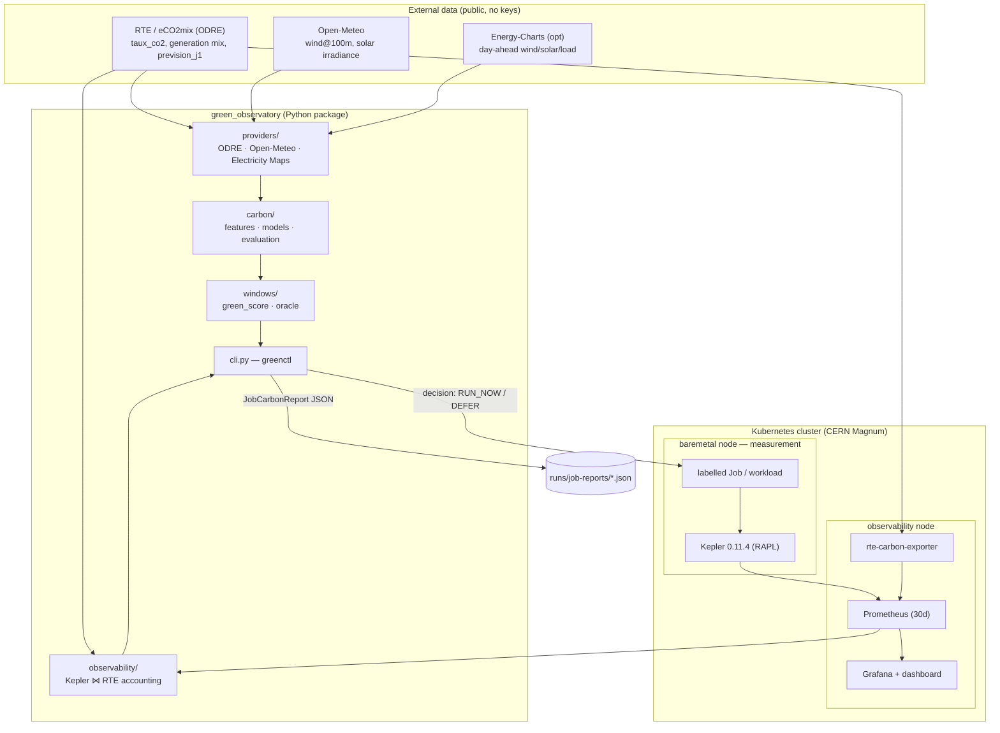
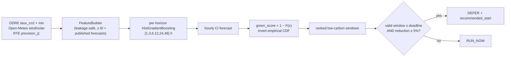
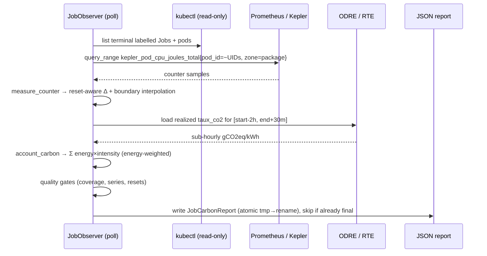
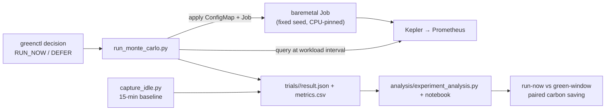

# Green Observatory — System Architecture

Carbon-aware **when-to-run** intelligence for deferrable compute, plus
per-workload **energy and carbon measurement** on Kubernetes.

This document describes the whole system end to end: the forecasting model that
decides *when* to run, the Kubernetes experiment that actually runs a workload,
the Kepler+RTE accounting that measures what it cost, and the real-time Grafana
layer that visualizes it. For the forecasting-only developer view see
[`green-decision-module/CLAUDE.md`](green-decision-module/CLAUDE.md); for the
per-Job accounting usage see
[`green-decision-module/docs/JOB_OBSERVABILITY.md`](green-decision-module/docs/JOB_OBSERVABILITY.md).

---

## 1. What the system answers

> Given a deferrable CPU workload and the next 1–48 hours of the French grid,
> **when** should it run to minimize operational carbon — and **how much**
> energy and CO₂ did a given run actually cost?

It is deliberately split into two tracks that share one ground truth (RTE
`taux_co2`) but are otherwise independent:

| Track | Question | Output | Live? |
|---|---|---|---|
| **A. Carbon forecasting** | When is the grid greenest? | ranked low-carbon windows, `RUN_NOW`/`DEFER` | forecast |
| **B. Per-Job observability** | What did this run cost? | audited energy + carbon JSON per Job | post-hoc |

A third, thin **real-time** layer (Grafana + Kepler + an RTE exporter)
visualizes energy live and carbon live-if-the-exporter-is-deployed. It is for
monitoring, not accounting — Track B stays authoritative.

---

## 2. High-level architecture



---

## 3. Repository layout

```text
green/
├── ARCHITECTURE.md                     ← this file (whole-system view)
├── green-decision-module/              ← the Python package + docs + tests
│   ├── src/green_observatory/
│   │   ├── providers/                  data adapters (ODRE, Open-Meteo, EM, Energy-Charts)
│   │   ├── carbon/                     feature engineering, forecasters, evaluation
│   │   ├── windows/                    green_score + perfect-foresight oracle
│   │   ├── observability/              ★ per-Job Kepler+RTE energy/carbon accounting
│   │   ├── exporters/                  report figures
│   │   ├── models.py / config.py       Pydantic contracts + YAML config
│   │   └── cli.py                      greenctl (carbon · windows · figures · jobs)
│   ├── configs/                        model + window-scoring + simulation YAML
│   ├── tests/                          58 unit tests (incl. test_job_observability.py)
│   ├── README.md · REPORT.md · CLAUDE.md · docs/JOB_OBSERVABILITY.md
│   └── runs/ · models/ · data/cache/   generated artifacts (git-ignored)
└── kubernetes/
    ├── experiment-01/                  ← the end-to-end shifting experiment
    │   ├── manifests/                  kepler-values, monitoring-values, workload Job
    │   ├── scripts/                    run_monte_carlo.py · capture_idle.py
    │   ├── analysis/                   experiment_analysis.py + notebook
    │   ├── idle/ · trials/             captured baselines and runs
    │   └── guide.md                    the experiment protocol (24 steps)
    └── observability/                  ← real-time layer (this work)
        ├── dashboards/                 Grafana dashboard + sidecar ConfigMap
        └── rte-carbon-exporter/        RTE→Prometheus exporter + manifests
```

★ = the energy/carbon measurement module.

---

## 4. Track A — carbon forecasting

A **forecaster ladder** behind one `Forecaster` interface, so the leakage-free
rolling-origin backtest scores them uniformly (weakest → strongest): persistence
→ climatology → corrected climatology → SARIMAX* → **direct multi-horizon
gradient boosting (primary)** → LSTM* → perfect-foresight oracle (upper bound).
`*` = optional comparison only; neither beats gradient boosting on this data.



**Locked conventions** (do not silently change):
- Ground truth = RTE `taux_co2`, **production-based** gCO₂/kWh, hourly UTC.
- `green_score ∈ [0,1]`, higher = greener; raw gCO₂/kWh always kept alongside.
- **No look-ahead leakage**: at decision time `t0`, features use only data ≤ `t0`
  (target-time weather/consumption forecasts are allowed — they are published
  before the target). `y(t0+h)` is a label only.
- Calendar/climatology grouping in `Europe/Paris`; instants stay UTC.
- Decision metric = **% of perfect-foresight saving captured**, not point error.
  Headline: 73 % at 24 h, 67 % at 48 h.

Primary metric is *ranking quality* (pick the greenest future hour), reported as
`% of perfect foresight`, Spearman, Top-1 — see `carbon/evaluation.py` and
`windows/oracle.py`.

---

## 5. Track B — per-Job energy & carbon accounting ★

The measurement core. Given a **terminal** Kubernetes Job, it produces one
auditable JSON combining Kepler CPU energy with realized RTE carbon intensity.
It is workload-agnostic (selects by label + pod UID; no Monte-Carlo specifics)
and read-only (`kubectl get`, Prometheus queries, ODRE fetch).

### 5.1 Module map (`src/green_observatory/observability/`)

| File | Responsibility |
|---|---|
| `cluster.py` | read-only `kubectl` (`KubectlClient`), pod lifetime extraction (`pod_execution`), job outcome, temporary `PrometheusPortForward` |
| `prometheus.py` | Prometheus HTTP client + Kepler pod-counter query (dedup running/terminated `state`) |
| `rte.py` | realized RTE signal: `OdreRealtimeCarbonSource` (live, cached) / `SnapshotCarbonSource` (offline replay) |
| `accounting.py` | **pure** math: `measure_counter` (reset-aware Δ + boundary interpolation) and `account_carbon` (energy-weighted join) |
| `reporter.py` | `JobReporter.build()` — orchestrates the above into a `JobCarbonReport` + quality gates |
| `observer.py` | `JobObserver` — idempotent poll loop, one JSON per terminal Job, atomic writes |
| `summary.py` | flatten many reports → comparison CSV (preserves `workload/policy/scheduler/experiment/trial`) |
| `models.py` | typed output contract (`JobCarbonReport`, `extra="forbid"`) |

### 5.2 The accounting method

Emissions are computed **per interval**, never with a single global average
intensity:

```text
emissions_gco2eq = Σ_intervals ( Δkepler_joules / 3_600_000  ×  RTE_intensity(interval) )
energy_weighted_intensity = emissions × 3_600_000 / Σ Δkepler_joules
```

- **Energy** — `kepler_pod_cpu_joules_total{zone="package"}`, a cumulative
  counter. `measure_counter` is **reset-aware** (RAPL wraparound / pod restart →
  charge the post-reset value) and **linearly interpolates** the two boundary
  scrape intervals so the Job is not charged for whole scrapes that straddle its
  start/finish. A brand-new pod may assume the counter started at 0 at creation.
- **Carbon** — for each energy increment, join to the latest RTE point at or
  before the increment midpoint, within `max_carbon_age = 35 min` (RTE cadence is
  15–30 min). Energy with no sufficiently recent RTE point is counted as
  *missing* and lowers coverage.
- **Quality gates** — a report is `valid`/`final` only when: total energy > 0,
  every pod has a Kepler series, `energy_coverage ≥ 0.90`, `carbon coverage ≥
  0.95`, and emissions are computable. Otherwise it stays **provisional** and the
  observer retries (RTE often publishes the last interval after the Job ends).

### 5.3 Accounting sequence



### 5.4 Output contract (abridged)

```jsonc
{
  "job":    { "uid": "...", "namespace": "green-experiment", "name": "mc-...", "labels": {…}, "outcome": "succeeded" },
  "energy": { "total_joules": 42411.29, "total_kwh": 0.011781, "average_power_watts": 45.60, "pods": [ … ] },
  "carbon": { "energy_weighted_intensity_gco2eq_per_kwh": 20.0, "emissions_gco2eq": 0.2356,
              "basis": "production", "accounting_scope": "operational_cpu_no_pue" },
  "quality":{ "valid": true, "final": true, "energy_coverage_ratio": 1.0,
              "carbon_energy_coverage_ratio": 1.0, "counter_resets": 0, "warnings": [] },
  "formula":"sum(delta_kepler_joules_interval / 3600000 * rte_carbon_intensity_gco2eq_per_kwh_interval)"
}
```

Scope is explicit and honest: **operational CPU energy attributed by Kepler, no
PUE**, not total node/server energy.

---

## 6. Track C — the Kubernetes experiment (`experiment-01`)

Runs the full loop for a deterministic, deferrable CPU workload (a fixed-seed
π Monte-Carlo) to test whether forecast-driven shifting cuts operational carbon
without changing the work done or the runtime.



- `scripts/run_monte_carlo.py` — applies the workload, waits, queries Kepler for
  the exact workload interval, writes `result.json` (+ raw Prometheus, metrics
  CSV). It **preflights** the baremetal node (aborts on a dirty node) for clean
  measurement.
- `scripts/capture_idle.py` — a formal ≥15-min idle baseline with the same
  quality gates.
- `analysis/` — auto-discovers `idle/` and `trials/`, applies quality gates, and
  produces the paired run-now-vs-green comparison and figures.

> **Consistency note.** `run_monte_carlo.py` computes pod energy independently of
> the `observability` module (a simpler `final_or_max` of the counter). On the
> same real Job the two agree to ~0.005 % (42 411 J vs 42 413 J). The module is
> the authoritative path because it is reset-aware, boundary-interpolated, and
> the only one that also computes carbon. Converging the script onto
> `observability.accounting` is the natural next step.

---

## 7. Track D — real-time visualization (`kubernetes/observability`)

Energy/power is in Prometheus already (Kepler, 10 s). Carbon is **not** — it is
computed post-hoc by Track B. To show carbon live, a tiny **RTE exporter**
publishes `rte_carbon_intensity_gco2eq_per_kwh` so Grafana can derive a live
emission rate:

```text
emission_rate_gco2eq_per_h = kepler_..._watts × rte_carbon_intensity_gco2eq_per_kwh / 1000
```

The dashboard (`dashboards/green-observatory-overview.json`, 14 panels) covers
node power (total/active/idle), CPU utilization, per-pod power/energy/emission
rate, live grid intensity, and range totals — filterable by node/zone/namespace/
pod. The Grafana sidecars need a one-line fix on this Magnum cluster
(`skipTlsVerify`, see the observability [README](kubernetes/observability/README.md)).

Grafana ≠ accounting: its range-integral emissions use the *current* intensity
as an approximation. For paper numbers, use `greenctl jobs report`.

---

## 8. Deployment topology

```text
Control-plane VM      sebas-green-…-master-0        Kubernetes control plane
Observability VM      sebas-green-…-node-0          Prometheus, Grafana, kube-state-metrics,
                        (role=observability)        rte-carbon-exporter
Baremetal worker      sebas-green-baremetal-…-0     Kepler 0.11.4 + the measured workload
                        (hardware=baremetal)
```

**Why this split, and the key operational constraint:** Kepler runs **only** on
the baremetal node (RAPL needs real hardware), and the observability components
are pinned to the VM node so they never perturb the node being measured. As a
direct consequence:

> Any workload you want measured **must** carry
> `nodeSelector: sustainability.cern.ch/hardware: baremetal` **and**
> `sustainability.cern.ch/track: "true"`, and stay visible until observed
> (do not set `ttlSecondsAfterFinished` below the poll interval). A pod scheduled
> elsewhere has no Kepler series and its report stays provisional forever.

---

## 9. Running any workload (generalization)

The measurement path is not Monte-Carlo-specific. To benchmark an arbitrary
deferrable Job:

1. Label the Job `sustainability.cern.ch/track=true` (+ optional
   `workload`/`policy`/`experiment`/`trial` dimensions that flow into the CSV).
2. Pin it to baremetal (`nodeSelector` above).
3. Let the observer account it:
   ```bash
   export KUBECONFIG=~/config
   greenctl jobs observe --namespace <ns> --output runs/job-reports      # continuous
   greenctl jobs report  <job> -n <ns> --output runs/job-reports         # one Job, on demand
   greenctl jobs summarize --reports runs/job-reports --output runs/job-reports/summary.csv
   ```
4. For carbon-aware placement, gate submission on the forecast
   (`greenctl carbon forecast` / `windows analyze`) before creating the Job.

Because the report preserves all Job labels, heterogeneous workloads compare in
one CSV without any per-workload code — the basis for future benchmarks and
simulations.

---

## 10. Conventions, invariants & limitations

**Invariants**
- RTE `taux_co2`, production-based gCO₂/kWh, UTC — the single ground truth for
  both forecasting and accounting. Never mix in a consumption-based intensity.
- RAPL zone `package` for attribution (avoids double-counting `core`).
- All timestamps UTC; calendar grouping in `Europe/Paris`.
- Pure numeric cores take explicit parameters; YAML only maps into them; runs are
  reproducible (fixed seeds, cached snapshots).

**Limitations**
- Energy is **operational CPU only** (Kepler/RAPL): no fans, NIC, disks, PSU,
  cooling; **no PUE** unless an official one is applied downstream.
- The forecast ceiling is set by wind-forecast quality, not model architecture;
  the backtest uses near-actual ERA5 weather as a forecast proxy (mildly
  optimistic).
- Real-time carbon depends on the exporter and on cluster egress to ODRE.
- `final = valid` in the reporter means a permanently unmeasurable Job (e.g. no
  Kepler series) is retried until `max_job_age`; consider marking such reports
  final-but-invalid to stop retries.

**Commands index**

```bash
# Forecasting (Track A)
greenctl carbon import | fetch-forecast | train | compare --test-start 2026-02-01
greenctl carbon forecast --horizon-hours 24
greenctl windows analyze --horizon-hours 48

# Measurement (Track B)
greenctl jobs report <job> -n <ns>
greenctl jobs observe [--once] -n <ns>
greenctl jobs summarize --reports runs/job-reports

# Experiment (Track C)
python kubernetes/experiment-01/scripts/capture_idle.py --duration 15m --zone package
python kubernetes/experiment-01/scripts/run_monte_carlo.py --trial-id <id>

# Real-time (Track D)
kubectl apply -f kubernetes/observability/dashboards/dashboard-configmap.yaml
kubectl apply -f kubernetes/observability/rte-carbon-exporter/

# Tests
pytest -q                       # 58 tests
```
